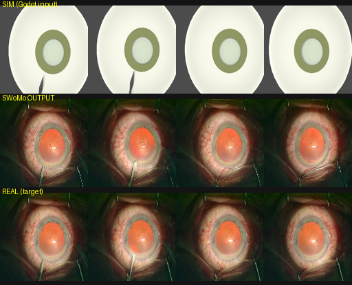

# SWoMo sim→real 復現實測(RTX 3070 8GB 可跑)

實測結論:SWoMo 論文的 **sim→real 擴散那半完全可復現**(權重+資料公開,8GB 消費級卡跑得動);
產生模擬影格的 **Godot 符號模擬器那半未開源**(只給預渲染成品)。詳見 [[6_modern_ai_ccc]]。

## 結果



`compare_case_2010.png` 三排(case_2010,取樣 4 個時間點):

- **上排 SIM(Godot 輸入)**:粗糙 CG,只有形狀、無真實質感 → 是擴散的**輸入**(`video_frames_sim`,他們預渲染的成品)。
- **中排 SWoMo 輸出**:擬真——瞳孔透出橘紅眼底反光、虹膜紋理、鞏膜血絲、真實光照。
- **下排 REAL 目標**:實際手術畫面。中排幾何跟著上排 sim、外觀貼近下排 real。

`frames/00.png…15.png` = 模型輸出的完整 16 幀(128×128)。

## 怎麼跑的(可重跑環境在專案外)

完整環境(repo + ~6GB 權重 + 抽出的資料,共 ~5.6GB)放在:

```
C:\Users\user\Desktop\GitHub\_models\SWoMo\
```

一鍵重跑:
```powershell
conda activate swomo
cd C:\Users\user\Desktop\GitHub\_models\SWoMo
python -u sample.py --inference_config ./configs/inference/run_local.yaml
```

### 關鍵工程點(8GB 卡踩過的坑)

| 項目 | 做法 |
|---|---|
| 版本 | img_graph_xvid(首幀+場景圖,**無 ControlNet**),最省 VRAM |
| 精度 | UNet/text_encoder → **fp16**;**VAE 保 fp32**(fp16 VAE 解碼 NaN → 全黑幀) |
| attention slicing | **不可開**——他們自訂 rotary attention 傳 `key_pos_idx`,`SlicedAttnProcessor` 不吃 |
| dtype 邊界 | `pipeline_conditional_animation.py` 補三處 fp16/fp32 轉換(first_frame_latents、static_vid、decode_latents) |
| 資料 | 用 `remotezip` 對 HF 遠端 zip 做 HTTP range,只抽 `case_2010` 一個 case(四來源各 48 幀對齊),避免下載 90GB |
| 基底模型 | 首次自動下載 `TIGER-Lab/ConsistI2V`(~5GB,快取後不再下) |
| 速度 | 50 步 DDIM、16 幀、CFG 3× 批次 ≈ 4–9 分鐘/段(RTX 3070) |

修改過的檔:`sample.py`(fp16 補丁)、`swomo/pipelines/pipeline_conditional_animation.py`(dtype 邊界)、
`configs/inference/run_local.yaml`(本機路徑)。

## 來源
- 論文:arXiv 2605.16530(SWoMo,MICCAI 2026 Early Accept)
- 程式:github.com/MECLabTUDA/SWoMo · 權重/資料:huggingface.co/SsharvienKumar/SWoMo
- 標註工具:github.com/MECLabTUDA/IntrekSAM(= 論文 §2 的 SAM2 標註工具)
